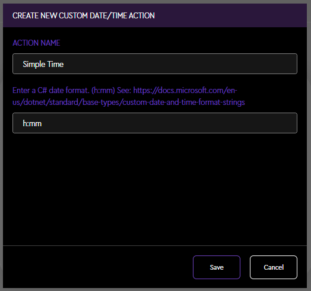

# Loupedeck Date/Time Plugin
> A plugin that shows the date or time using a supplied format string.

# Usage

Simply add a custom format following the c# date format [here](https://docs.microsoft.com/en-us/dotnet/standard/base-types/custom-date-and-time-format-strings)

To show the time as `9:45`, use `h:mm` as the format.

